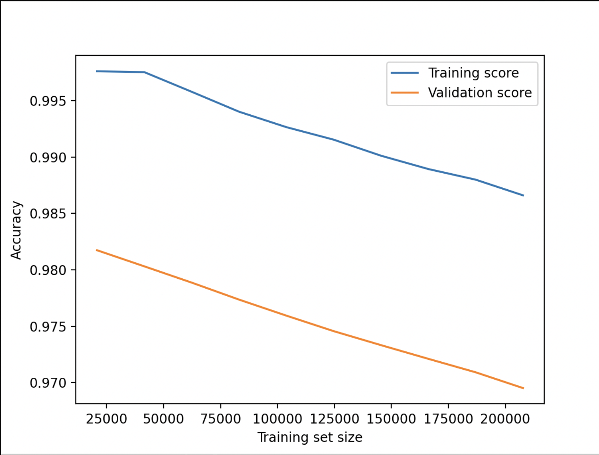

# Binary Model Fast Training Pipeline
The Binary Model class has been extended to allow the user to add and train a binary on a given directory with pcap files.

## Design
A **plot_learning_curve** method has been added to the **BaseModel** class to help visualize the learning curve. Accuracy is the metric chosen to represent the learning. This method is being used in the **ModelManager** class in the **train_classifier** method.

## Usage
To add a new model to a to the model array use the following script:
```python
manager = BinaryModel()
manager.add_device(device_name, device_directory)
```

# Learning Curve and Required Dataset Size
When adding a device the learning curve might have a tendency to decrease over time. Although it is to be expected for the training accuracy (as the model stops "memorizing data" and starts looking for patterns), it might be alarming in the case of the validation
accuracy. It might be a sign that the dataset is not large enough for the model to fully understand the statistical patterns.



# Limitations
Dataset becomes progressively more imbalanced with every new device added and at some point it will be required that the model gets retrained